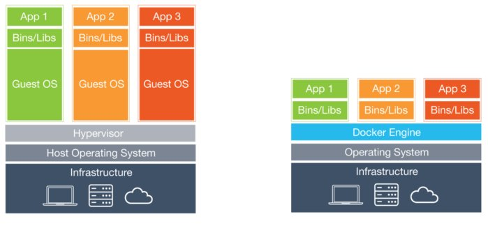

# Sample Docker Endpoint: Docker Intro Project

## Overview
This project is intended to be a simple introduction to Docker containerization. The project uses Go has the main source code but there is no real need to understand or even have Go installed. This is one huge advantage to containerization. The build environment and the environment in which the code runs is completely separate from your local machine. Therefore, this image can be built and run on any machine that has Docker installed with no other setup involved. This also helps to isolate the development from different environments on different developers machines so different versions, etc. don't affect the build process. Once Docker (Docker Machine is recommended too) is installed, `docker-compose up -d` will build and run this project on your machine. After you can go to `http://localhost:8080` and you will be redirected to ebay.com.

## What is Docker?

- **Containers**

    Containers are an abstraction at the app layer that packages code and dependencies together. Multiple containers can run on the same machine and share the OS kernel with other containers, each running as isolated processes in user space. Containers take up less space than VMs (container images are typically tens of MBs in size), and start almost instantly.

- **VMs**

    Virtual machines (VMs) are an abstraction of physical hardware turning one server into many servers. The hypervisor allows multiple VMs to run on a single machine. Each VM includes a full copy of an operating system, one or more apps, necessary binaries and libraries - taking up tens of GBs. VMs can also be slow to boot.

## Key Benefits of Docker
- **Isolation**

    As I mentioned above, using Docker to containerize your application allows you to almost completely isolate your application from your local environment. Using Docker Machine as recommended above further isolates your development by running your container inside of a VM on your local machine which helps to avoid volume and network differences on your local machine to affect your Docker container. All of this also applies to your deployment environment. On a machine or VM where your Docker containers are deployed they are completely isolated from the machine itself and other applications running on that host. 

- **Multi-Platform**

    Due to the isolation principles of Docker as discussed in the first point Docker allows your to run in almost any environment with very minimal changes to your application. This means the same image can run on a Windows machine, a Linux VM, your local Mac environment or somewhere in the cloud with no changes to application itself. This simplifies the process of developing and deploying a Docker container.

- **Rapid Development and Deployment**

    Isolation and Multi-Platform support together result in a huge decrease in development and deployment time. With the reduction of environment specific interferences, the ability to develop and deploy on your platform of choice and the ability to version your images easily the amount of time to develop and deploy is significantly decreased.

- **Security**

    Docker uses host OS sensitive mount points (e.g., ‘/proc’ and ‘/sys’) as read-only mount points and uses a copy-on-write filesystem to make sure containers can’t read each other’s data. It also limits system calls to your host OS and works well with SELinux. Docker Images that are available on Docker Hub are digitally signed to ensure authenticity. Since Docker containers are isolated and resources are limited, even if one of your applications is hacked, it won’t affect applications that are running on other Docker containers.

## Your Basic Commands

1. `docker build ./` or `docker-compose build`
    
    Builds the Docker image described by the Dockerfile in your current directory.

2. `docker run -d IMAGE` or `docker-compose up -d` (-d is detached from terminal)

    Creates and runs a container from the IMAGE. 

3. `docker stop CONTAINER` or `docker-compose down`

    Stops the container CONTAINER. 

4. `docker logs CONTAINER` or `docker-compose logs`

    Shows your the logs for CONTAINER.

5. `docker exec -it CONTAINER_ID` or `docker-compose exec CONTAINER`

    Starts an interactive shell inside the container

6. `docker images` or `docker-compose images`

    Lists the images in your local Docker repository.

7. `docker pull IMAGE` / `docker push IMAGE`

    Pulls/Pushes the Docker IMAGE from the remote Docker repository that you are connected to

\*\*Unless otherwise noted, for docker-compose the command refers to the container from the image described by the docker-compose.yml file in your current directory.

## Getting Started with this Project

1. Install Docker -> https://store.docker.com/search?type=edition&offering=community
    - OPTIONAL: Install and create a Docker Machine -> https://docs.docker.com/machine/ 
2. Clone this repo
3. Run container -> `docker-compose up -d`
4. Curl or go to http://localhost:8080/ in browser

***

## References
### General References
- Get Docker: https://store.docker.com/search?type=edition&offering=community
- Get Started Tutorial: https://docs.docker.com/get-started/
- Docker Machine: https://docs.docker.com/machine/ 
- Docker Compose: https://docs.docker.com/compose/
- Dockerfile: https://docs.docker.com/engine/reference/builder/
- Docker Hub: https://hub.docker.com/
- 5 Key Benefits of Docker: https://dzone.com/articles/5-key-benefits-docker-ci

### Further Reading
- Docker Networking: https://docs.docker.com/network/
- Docker Volumes/Mounts: https://docs.docker.com/storage/
- Docker Logging: https://docs.docker.com/config/containers/logging/
- Kubernetes (generic tess.io): https://kubernetes.io/docs/user-journeys/users/application-developer/foundational/
